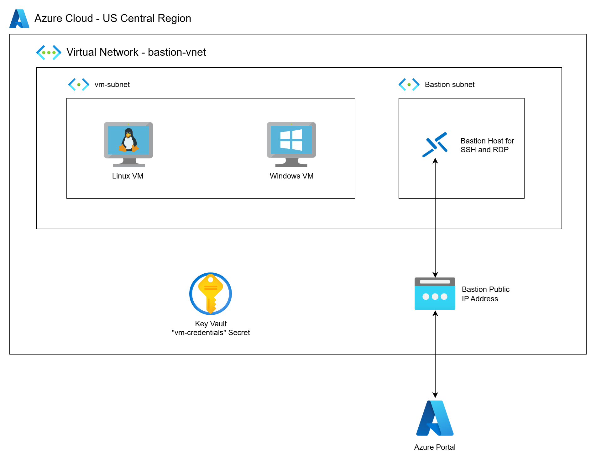

# Deploying an Azure Bastion Host

This project demonstrates how to securely access private virtual machines in Azure using an Azure Bastion host. In many of our prior demos, we used Bastion without diving into its purpose or how it works. This standalone video fills that gap.

We’ll build a simple, secure environment with:

- A custom **Virtual Network** with appropriate subnetting
- A **private Windows VM**
- A **private Linux VM**
- An **Azure Bastion host**
- An **Azure Key Vault** to store credentials securely

All VMs are deployed without public IPs. Bastion enables secure, browser-based RDP/SSH access over the Azure portal without exposing your VMs to the internet.

 
 
## Understanding Azure Bastion Deployment

Azure Bastion is a fully managed PaaS service that lets you securely connect to your Azure VMs through the Azure Portal using RDP or SSH — without exposing the VMs to the public internet.

Here’s how you configure it correctly:

### 1. **Create a Virtual Network (VNet)**
- Bastion must be deployed into a VNet that has private network connectivity (via same VNet, VNet peering, or VPN) to the virtual machines it will access.
- Ensure the address space is large enough to include multiple subnets (e.g., `10.10.0.0/16`).

### 2. **Define Required Subnets**
You must create a subnet specifically for Bastion:

```hcl
name = "AzureBastionSubnet"
address_prefixes = ["10.10.254.0/24"]
```

- **Important:** The name must **exactly** be `AzureBastionSubnet` or Azure will reject the deployment.
- Additional subnets (e.g., `vm-subnet`) host the actual virtual machines. Do not place resources directly inside `AzureBastionSubnet`.
- The CIDR block for `AzureBastionSubnet` needs to have at least 64 IP addresses.

### 3. **Provision the Bastion Host**
- The Bastion host gets a **public IP** (used only by you via the Azure Portal).
- It's deployed into the `AzureBastionSubnet`.
- The VMs do **not** need public IPs

```hcl
resource "azurerm_bastion_host" "bastion" {
  name                = "bastion-host"
  location            = azurerm_resource_group.rg.location
  resource_group_name = azurerm_resource_group.rg.name
  dns_name            = "bastion-demo"

  ip_configuration {
    name                 = "configuration"
    subnet_id            = azurerm_subnet.bastion.id
    public_ip_address_id = azurerm_public_ip.bastion.id
  }
}
```

### 4. **Network Security Group (NSG) Requirements**
While Azure Bastion will function without specifying a Network Security Group (NSG) for the `AzureBastionSubnet`, associating an NSG is a recommended best practice to secure traffic to and from the Bastion host. If you choose to apply an NSG, specific inbound and outbound rules are required to ensure Azure Bastion operates correctly. Omitting these rules may disrupt connectivity or prevent Bastion from functioning.

```hcl
resource "azurerm_network_security_group" "bastion_nsg" {
  name                = "bastion-nsg"
  location            = azurerm_resource_group.bastion_rg.location
  resource_group_name = azurerm_resource_group.bastion_rg.name

  security_rule {
    name                       = "AllowHttpsInbound"
    priority                   = 100
    direction                  = "Inbound"
    access                     = "Allow"
    protocol                   = "Tcp"
    source_address_prefix      = "Internet"
    destination_port_range     = "443"
    source_port_range          = "*"
    destination_address_prefix = "*"
  }

  security_rule {
    name                       = "AllowSSHAndRDPOutbound"
    priority                   = 120
    direction                  = "Outbound"
    access                     = "Allow"
    protocol                   = "Tcp"
    destination_port_ranges    = ["22", "3389"]
    source_address_prefix      = "*"
    source_port_range          = "*"
    destination_address_prefix = "*"
  }

  security_rule {
    name                       = "AllowAzurePlatformOutbound"
    priority                   = 130
    direction                  = "Outbound"
    access                     = "Allow"
    protocol                   = "*"
    destination_port_range     = "*"
    source_port_range          = "*"
    source_address_prefix      = "*"
    destination_address_prefix = "AzureCloud"
  }
  depends_on = [ azurerm_bastion_host.bastion-host ]
}
```


## Prerequisites

* [An Azure Account](https://portal.azure.com/)
* [Install AZ CLI](https://learn.microsoft.com/en-us/cli/azure/install-azure-cli) 
* [Install Latest Terraform](https://developer.hashicorp.com/terraform/install)

If this is your first time watching our content, we recommend starting with this video: [Azure + Terraform: Easy Setup](https://www.youtube.com/watch?v=j4aRjgH5H8Q). It provides a step-by-step guide to properly configure Terraform, and the AZ CLI.

## Download this Repository

```bash
git clone https://github.com/mamonaco1973/azure-bastion.git
cd azure-bastion
```

## Build the Code

```bash
azureuser@develop-vm:~/azure-bastion$ ./apply.sh
NOTE: Validating that required commands are found in your PATH.
NOTE: az is found in the current PATH.
NOTE: terraform is found in the current PATH.
NOTE: jq is found in the current PATH.
NOTE: All required commands are available.
NOTE: Validating that required environment variables are set.
NOTE: ARM_CLIENT_ID is set.
NOTE: ARM_CLIENT_SECRET is set.
NOTE: ARM_SUBSCRIPTION_ID is set.
NOTE: ARM_TENANT_ID is set.
NOTE: All required environment variables are set.
NOTE: Logging in to Azure using Service Principal...
NOTE: Successfully logged into Azure.
Initializing the backend...
Initializing provider plugins...
- Finding latest version of hashicorp/azurerm...
- Finding latest version of hashicorp/random...
- Installing hashicorp/azurerm v4.32.0...
```

## Build Results

After applying the Terraform scripts, you’ll see the following resources in your Azure subscription:

### 📁 Resource Group
- All resources are grouped under the same resource group (default: `bastion-demo-rg`)

### 🌐 Networking
- A custom virtual network with two subnets:
  - `vm-subnet` (for VMs) connected to a NAT gateway
  - `AzureBastionSubnet` (required name for Bastion)

### 🔐 Azure Key Vault
- Stores the admin usernames and passwords as secrets
- Used by Terraform to provision credentials securely

### 🖥️ Virtual Machines
- 1x **Windows Server 2022 VM** (no public IP)
- 1x **Ubuntu Linux VM** (no public IP)
- Both deployed in separate private subnets

### 🔐 Bastion Host
- Enables secure RDP/SSH access through the Azure Portal
- Deployed into the `AzureBastionSubnet` with its own public IP

## Bastion Demo 

In the demo portion of the video, we show:

1. Navigating to the resource group in the Azure Portal
2. Inspecting the deployed VMs and verifying they have no public IPs
3. Using Azure Bastion to:
   - SSH into the Linux VM via browser
   - RDP into the Windows VM via browser
4. Verifying that credentials were securely stored in Key Vault
5. Reviewing security and subnet architecture

